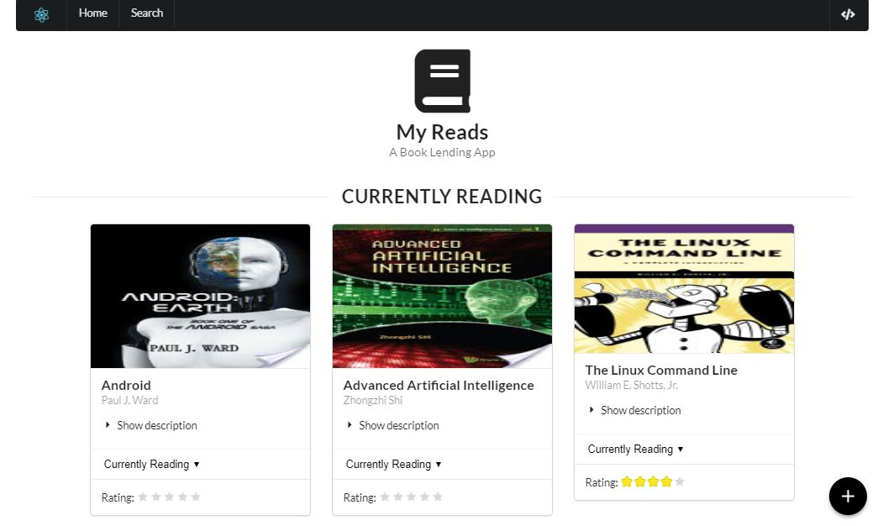

# MyReads Project

This is a final assessment project for Udacity's React Fundamentals course, in order to demonstrate understanding of a React app structure.

My Reads is an app where you can organize the books you have read, want to read or is currently reading on a digital shelf provided by the app itself.

This project was bootstrapped with [Create React App](https://github.com/facebookincubator/create-react-app).

[A live demo of the app can be found here.](https://myreads-psatler.herokuapp.com/)

## Installation

To get started developing right away:
* clone the project to your local machine using `git clone https://github.com/psatler/myReads_React.git`
* go to the directory where the it was downloaded
* install all project dependencies with `npm install`
* start the development server with `npm start`

## Application

Below is shown the home page and the search page of the app. In the home page, books are organized by shelf, which can be either _Currently Reading_, _Want to Read_ or _Read_.

The search page displays the books matched with the query entered in the search input field. A list of search terms is at the [Search Terms](#search-terms) section .  

## Search Terms

The backend API uses a fixed set of cached search results and is limited to a particular set of search terms, which can be found in [SEARCH_TERMS.md](SEARCH_TERMS.md) and are shown below. That list of terms are the _only_ terms that will work with the backend, so don't be surprised if your searches for Basket Weaving or Bubble Wrap don't come back with any results.

'Android', 'Art', 'Artificial Intelligence', 'Astronomy', 'Austen', 'Baseball', 'Basketball', 'Bhagat', 'Biography', 'Brief', 'Business', 'Camus', 'Cervantes', 'Christie', 'Classics', 'Comics', 'Cook', 'Cricket', 'Cycling', 'Desai', 'Design', 'Development', 'Digital Marketing', 'Drama', 'Drawing', 'Dumas', 'Education', 'Everything', 'Fantasy', 'Film', 'Finance', 'First', 'Fitness', 'Football', 'Future', 'Games', 'Gandhi', 'Homer', 'Horror', 'Hugo', 'Ibsen', 'Journey', 'Kafka', 'King', 'Lahiri', 'Larsson', 'Learn', 'Literary Fiction', 'Make', 'Manage', 'Marquez', 'Money', 'Mystery', 'Negotiate', 'Painting', 'Philosophy', 'Photography', 'Poetry', 'Production', 'Programming', 'React', 'Redux', 'River', 'Robotics', 'Rowling', 'Satire', 'Science Fiction', 'Shakespeare', 'Singh', 'Swimming', 'Tale', 'Thrun', 'Time', 'Tolstoy', 'Travel', 'Ultimate', 'Virtual Reality', 'Web Development', 'iOS'
